[目录]

<!-- TOC -->

- [Zoomla!逐浪CMS卓越出品](#zoomla逐浪cms卓越出品)
    - [Zoomla-Cli-Studio开发栈：基于Uni-app的小程序全案源码](#zoomla-cli-studio开发栈基于uni-app的小程序全案源码)
    - [使用说明](#使用说明)
    - [本项目介绍](#本项目介绍)
    - [开放性说明](#开放性说明)
    - [使用说明](#使用说明-1)
    - [排错表](#排错表)
- [接口文档](#接口文档)
    - [ZoomlaCLI-Studio接口使用说明](#zoomlacli-studio接口使用说明)
    - [本程序目录结构](#本程序目录结构)
- [系统运行效果图](#系统运行效果图)

<!-- /TOC -->


# Zoomla!逐浪CMS卓越出品

## Zoomla-Cli-Studio开发栈：基于Uni-app的小程序全案源码
***一种在网站后台就能直接获取git和npm源码、一键配置接口数据并直接生成智能门户的解决方案-源自18年技术积累、alexa中文排名第一的Zoomla!逐浪CMS团队！***

Zoomla!逐浪CMS：中文业界alexa排名第一的CMS系统|专注.net与windows平台企业级研发，集成内容管理、webfont、商城、店铺、黄页、教育、考试、3D、三维全景、混合现实、CRM、ERP、OA、论坛、贴吧等为一体，打造国内高端的CMS产品典范。

官网：www.z01.com

免费下载：www.z01.com/pub

视频教程：www.z01.com/mtv

模板资源：www.z01.com/mb

逐浪字库： http://f.ziti163.com

zico中文图标库：http://ico.z01.com


QQ交流群号：
[](https://jq.qq.com/?_wv=1027&k=5Ephzpq)   [](https://jq.qq.com/?_wv=1027&k=50a28BK) 


官方QQ客服：
[](http://wpa.qq.com/msgrd?v=3&uin=745151353&site=qq&menu=yes)  [](http://wpa.qq.com/msgrd?v=3&uin=1799661890&site=qq&menu=yes) 


## 使用说明

- 1.使用HBuilderX开发，源码包目录为`01-SoundCode`。
- 2.接口配置文件为`common\http.interceptor.js`,更改下面代码段（从逐浪CMS后台接口获得相应信息）：
```
const appid = 'cd3c2bf95091673cd023251cda6dd';
const apikey = '4b434af0977dbe552322323321d9';
const hostApi = 'https://www.z01.com';
```
- 3.获得小程序源码和接口key后，运行即可。


## 本项目介绍

这是一个为基于uni-app开发的小程序项目：
- 服务端基于Zoomla!逐浪CMS v8.5数据接口，使用手册http://help.z01.com
- 前端CLI开发框架基于Vue Cli
- 前端web呈现基于Boostrap V5.x，采用BootstrapVue插件，中文官网http://code.z01.com/bootstrap-vue
- icon图标库基于国产zico图标库，官网http://ico.z01.com
- map地图组件基于vue-baidu-map
- 基于vue-meta组件，完美支持各个页面标题、关键字、网页描述（mkt)描述与SEO|SMO优化
- 支持chrome和现代化浏览器，兼容IE11与EDGE浏览器
- 完美支持微信与小程序接入与二次开发
- 图标基于svg现代制图。
- CSS基于scss，采用souce map协议，便于编译与管理。

## 开放性说明
本项目基于Zoomla!逐浪CMS接口开发，集成门户、商城、OA、办公、ERP、微信与小程序管理 ，用户可以自由部署、自由二次开发，内置千套模板，完全免费开源，数据接口也全面开放。

有道是：

- 建网站,选逐浪。
- 易上手,功能棒。
- 质量好,服务善。
- 高性能,最划算。

## 使用说明
1、先安装Vue CLI，安装方法：
```
npm install -g @vue/cli
# OR
yarn global add @vue/cli
```

2、安装nodeJS，即`npm`支持，或`yarn`。

3、获取本程序包后，在程序根目录安装Node环境，安装命令：
```
npm install
# or
yarn install
```

4、运行，输入下面命令就能成功运行：
```
npm run serve
# or
yarn serve
```

5、发布最终版本（最终发布目录存于dist目录下）
```
npm run build
# or
yarn build
```

6、整理修复与优化
```
npm i line
# or
yarn lint
```

## 排错表

**运行时报错：Cannot find module 'webpack/lib/RequestShortener'**
这可能是本地webpack版本问题，建议你执行下面命令纠正它，然后再次运行`npm run serve`：
```npm install webpack --save-dev```

**提示'vue-baidu-map in ./src/main.js'错误，执行安装百度地图组件**
```npm install --save vue-baidu-map```
>安装地图组件时如果出错，请将根目录的`package-lock.json`删除再执行安装，安装完成再恢复`package-lock.json`文件，即可。

**其它几个组件安装方法（如果不报错可忽略并不需要逐一手动安装）**
```
npm install zico
npm install vue bootstrap-vue bootstrap
npm install vue-meta -s
```

# 接口文档
## ZoomlaCLI-Studio接口使用说明
 [ZoomlaCLI-Studio接口使用说明](源码与接口使用说明/ZoomlaCLI-Studio接口使用说明.md)
## 本程序目录结构
 [本程序目录结构](源码与接口使用说明/本程序目录结构.md)

# 系统运行效果图
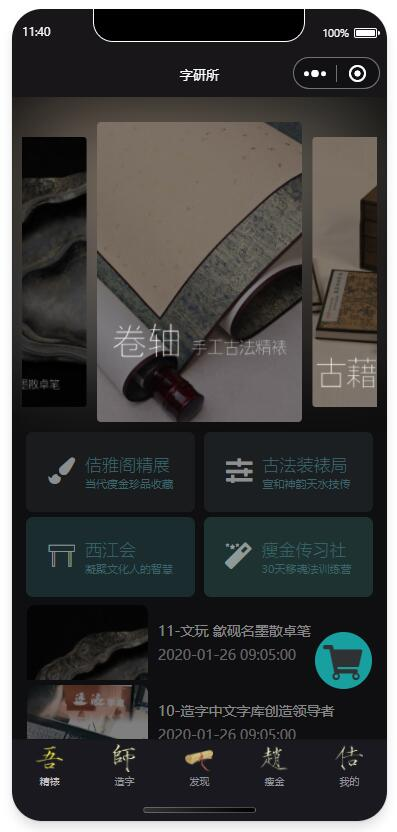
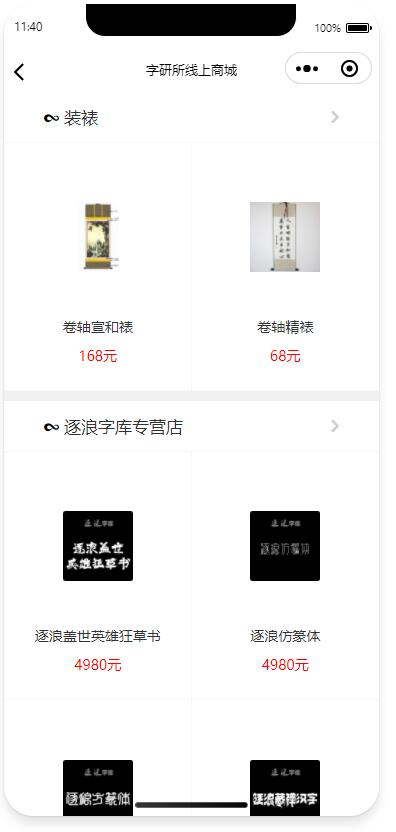
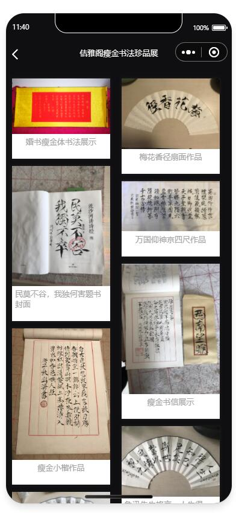
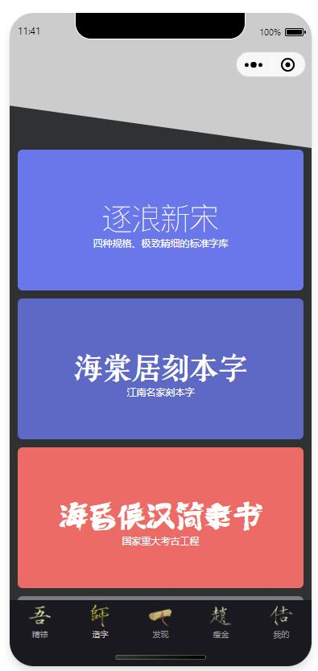


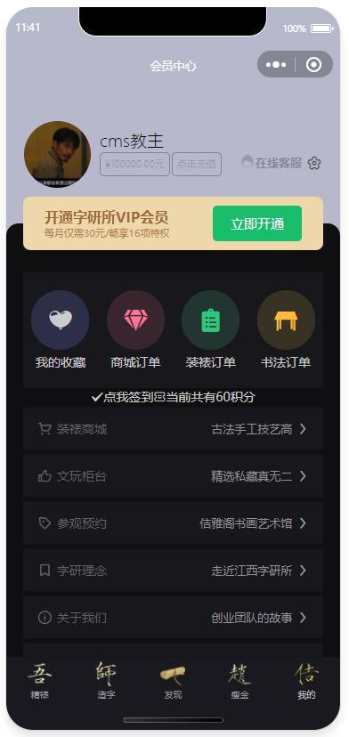
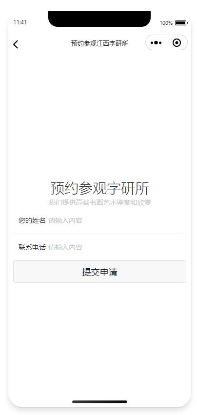
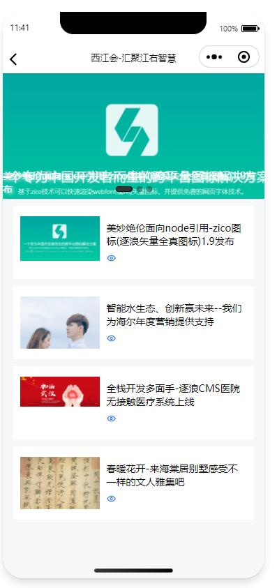

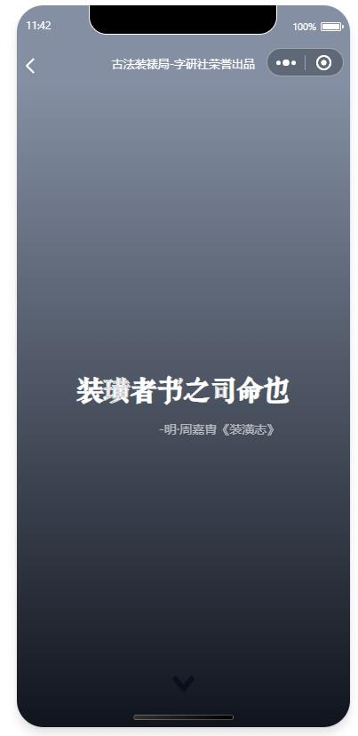
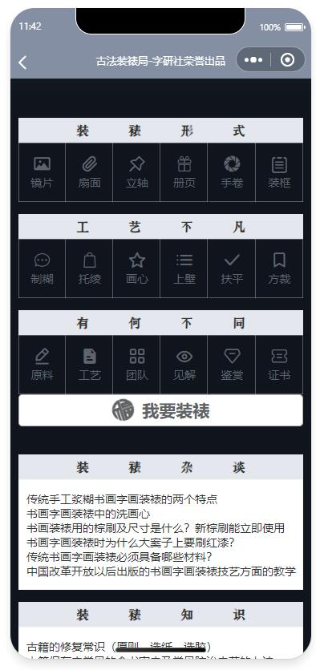
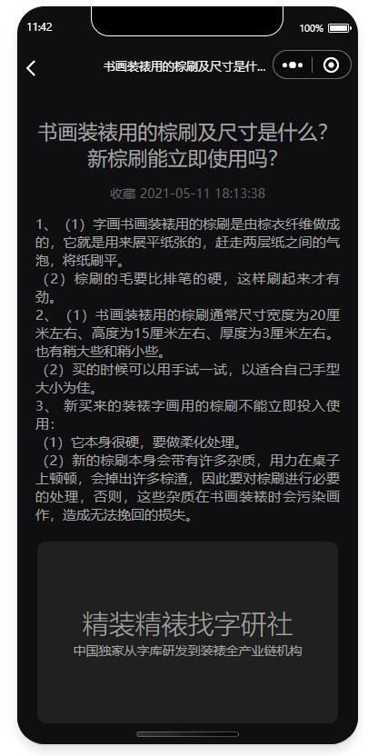
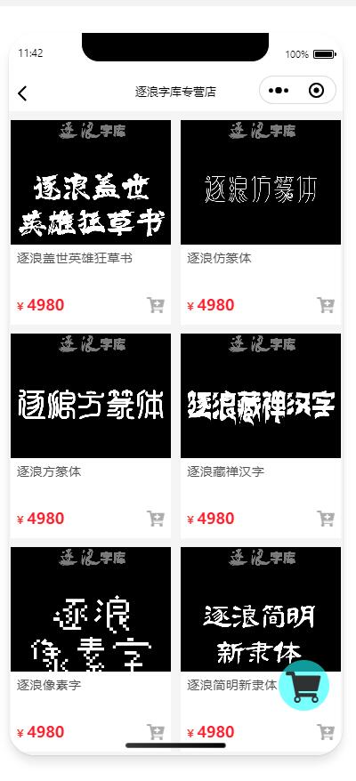
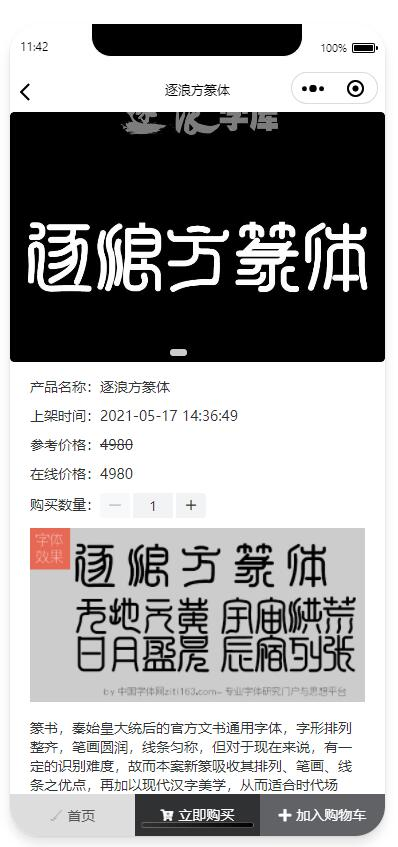
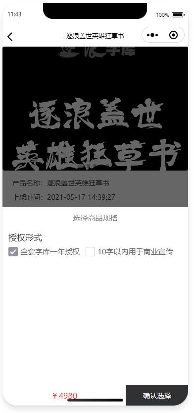
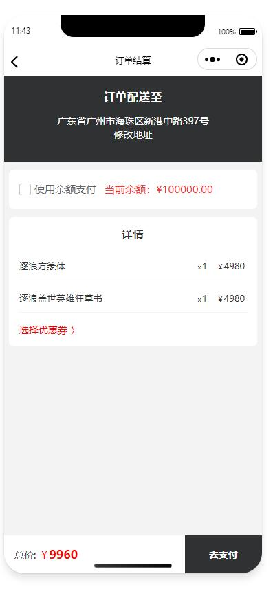
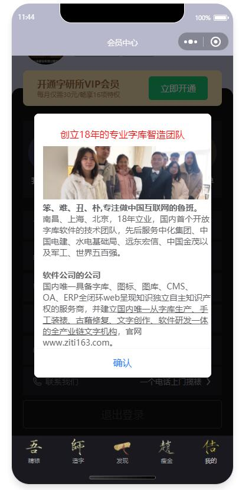


